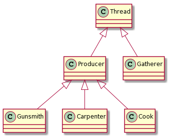
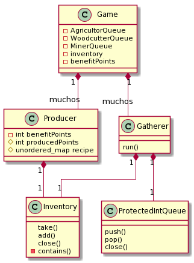

# Trabajo Practico N°2

Trabajo practico N°1 de Taller de Programación 1(75.42)

*Alumno:* Julián Crespo

*Padron:* 100490

*Repositiorio:* https://github.com/komod0/tp2

---

### Diseño

Para el diseño del trabajo practico se intento encapsular y separar lo mayor posible al código dentro de clases, se puede ver el tp como 3 partes distintas, por un lado esta la clase Game que es la encargada de crear los trabajadores, llenar las colas  y poner en marcha el juego, por otro lado estan los recolectores que se encargan de tomar cosas de las colas correspondientes a cada uno y depositarlas en el inventario y finalmente estan los productores que se encargan de tomar cosas del inventario y convertirlas en puntos de beneficio.

La parte de la clase Game parsea el archivo del mapa y desposita los recursos obtenidos en las colas, cada tipo de recolector tiene una cola distinta asociada para simplificar la tarea, ademas de eso tambien crea a los trabajadores a partir del archivo de configuracion dada.
Se muestra un diagrama mostrando las relaciones de herencia que hay presentes:

Como se puede ver los recolectores pertenecen todos a una misma clase y se diferencian entre si solo en la cola que reciben de la cual toman recursos, como no hay diferencia entre los tipos prácticamente se decidió no crear clases especificas a cada tipo y en cambio representarlos a todos con la clase genérica _Gatherer_.

Por otro lado los productores si tienen una clase especifica para cada tipo, esto se decidió hacer ya que los distintos tipos de productores pueden procesar no solo distintos tipos de recursos como también distinta cantidad de cada tipo y ademas generar una cantidad distinta de puntos de beneficio. Si bien se podría haber evitado esto y haberse quedado solo con la clase padre _Producer_ y haberle pasado a la hora de crearlo los recursos que procesa y los puntos de beneficio que genera, se prefirió por esta opción ya que no se quiso hardcodear en la parte de la creación de los productores(que esta en la clase Game) estos valores, de esta forma si se quieren agregar productores a futuro solo hace falta crear la clase correspondiente y especificar los valores alli mismo.

Las colas de recursos de cada tipo de recolector se implementaron como colas bloqueantes, se uso como guía lo presentado en clase con alguna que otra modificación para lograrlo.

Se adjunta un diagrama de las distintas relaciones de composicion, etc:

La parte del inventario fue la que consumió mayor cantidad de tiempo, se partió de un esqueleto parecido al de la cola bloqueante pero ahora la estructura subyacente es un _unordered_map_ del estilo `{RECURSO: cantidad_disponible}`, comparten similaridades entre si pero la particularidad que posee el inventario es que ahora no solo se deben ingresar y quitar cosas por un único lugar sino que también la lógica de saber si alguno de los productores que esta en espera(mediante la condition variable correspondiente) puede trabajar se vuelve mas complicada, para solucionar esto se implemento una función `contains()` como método _privado_(privado ya que no es thread-safe y no se debería usar desde afuera) del inventario que sirve para que, una vez un productor se despierta, este pueda saber si ya puede trabajar o si vuelve a dormir, la función mencionada recibe un unordered_map del estilo: `{recurso : cantidad}` y cada tipo de productor posee uno distinto(que refleja la cantidad de recursos que necesita para poder trabajar), al mismo tiempo cada vez que un recolector deposita un recurso nuevo en el inventario se les notifica a todos los productores en espera con un `notify_all()` , esto puede resultar un poco ineficiente ya que se puede estar despertando a alguien que aun no puede hacer nada, se consideraron otras opciones(mantener una lista de los productores actuales, e irles preguntando uno a uno, o mantener una lista de los distintos tipos y preguntar si alguno puede trabajar) pero se decidió mantenerlo simple, ya que las otras opciones no constituian una diferencia muy notable(aun se despertaba a trabajadores que no podían hacer nada) y complejizaba la logica del inventario y del juego.

Finalmente para la parte del contador de puntos se decidió por usar simplemente una variable del tipo _atomic<int>_ , ya que se consideró que no valía la pena construir un monitor solo para que contenga una variable del tipo _int_ y un método para incrementarla, al ser algo lo suficientemente simple se uso simplemente una variable atomica.

